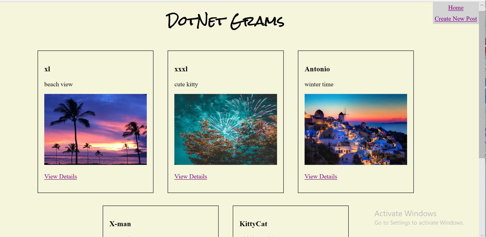
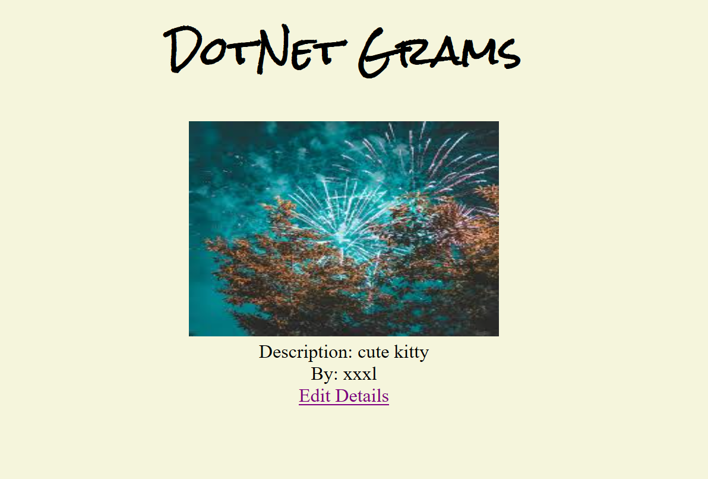
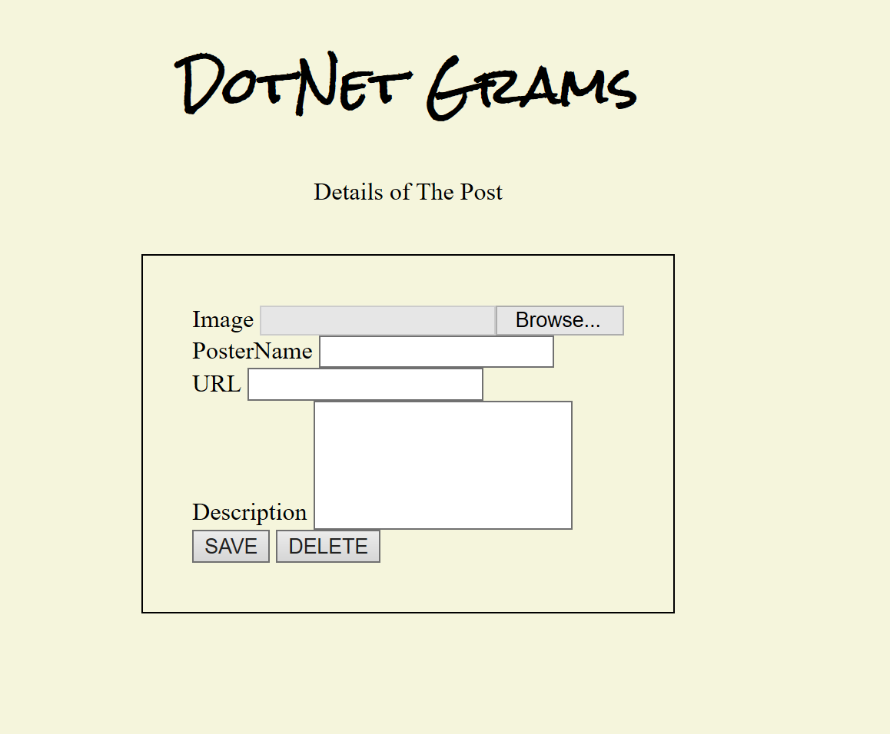
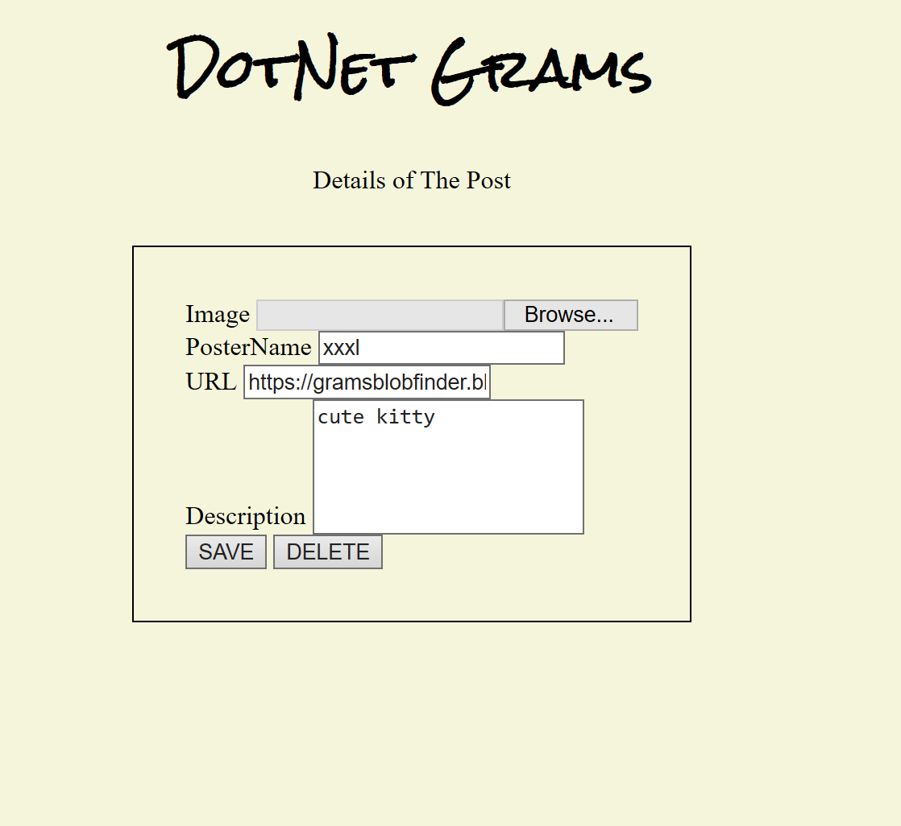
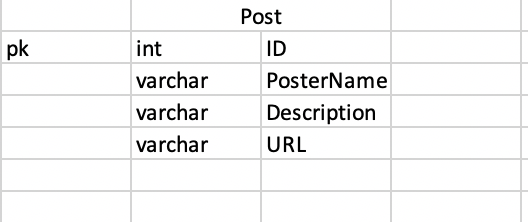

# Lab15-DotNet-Gram

Deployed this app at:https://dotnet-grams-lx.azurewebsites.net/

This is a web app using Razor pages with Sql database and Azure blob storage. Users can share their posts on this web app and can edit each post and delete the post if they don't like.

Users also can upload their image from local computer.

# Happy Path:

Homepage: show all the posts with the name of Poster and image and its description, under very post will have a link to view details.

When click on view details you will see the detail of that post

When you click on the create new at the right corner , you will get an empty form to fill out the details about the new post.

You can also edit / delete the post

#Schema

#Technologies used

Azure Blob Storage, Asp.Net Core,Razor pages,SQL server
Mainly use C#